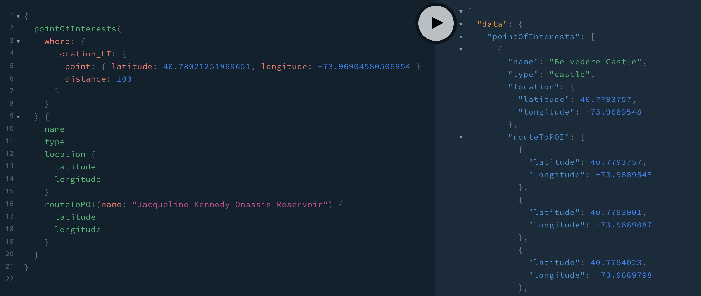

[](https://codesandbox.io/s/github/neo4j-graph-examples/openstreetmap/tree/main/graphql?file=/schema.graphql)

# GraphQL API

This directory contains a Node.js GraphQL API application using [`@neo4j/graphql`](https://www.npmjs.com/package/@neo4j/graphql).

Try it live on CodeSandbox [here](https://codesandbox.io/s/github/neo4j-graph-examples/openstreetmap/tree/main/graphql?file=/schema.graphql)

## Setup

First, edit `.env`, replacing the defaults with your database connection string, user, and database (optional):

```
NEO4J_URI=
NEO4J_USER=
NEO4J_PASSWORD=
NEO4J_DATABASE=
```

The `NEO4J_DATABASE` environment variable is optional and can be omitted. When omitted the default database will be used.

Next, install dependencies.

```
npm install
```

Then start the API application,

```
npm run start
```

This will start a local GraphQL API server at `localhost:4000`.

## Example GraphQL Queries

```GraphQL
{
  pointOfInterests(
    where: {
      location_LT: {
        point: { latitude: 40.78021251969651, longitude: -73.96904580506954 }
        distance: 100
      }
    }
  ) {
    name
    type
    location {
      latitude
      longitude
    }
    routeToPOI(name: "Jacqueline Kennedy Onassis Reservoir") {
      latitude
      longitude
    }
  }
}
```

